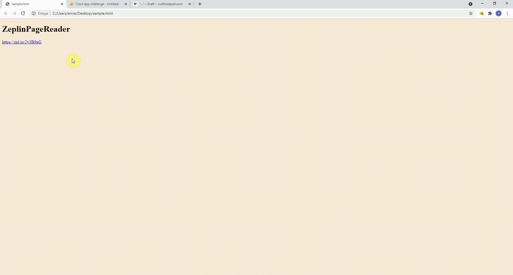

# Zeplin Page Reader

Zeplin page reader is a simple chrome extension. It copy page content and notes without any content click action.

## Installation

- Chrome manage extensions -> Load Unpacked -> Select extension directory
- Open new zeplin tab
- Click copy token from extension ui
- Put token to credential.js ( var token =  "<__token__>";) and save file
- Refresh extension from Manage Extensions
- Refresh opened zeplin/jira page
